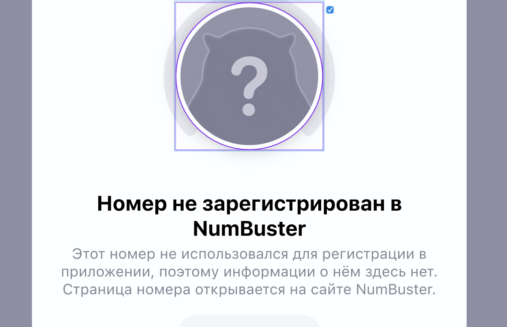

<div align="center">


# WarpGen

**Десктопное приложение, которое собирает конфиги Cloudflare WARP для AmneziaWG 2.x и WireGuard —
и само находит рабочий endpoint в вашей сети.**

[](https://github.com/limeflash/warpgen-amnezia/actions/workflows/release.yml)


-3178C6?logo=typescript&logoColor=white)
[](LICENSE)

</div>

<div align="center">
  
</div>

---

## Что это

Генератор WARP-конфигов, который не просто выдаёт файл, а доводит его до рабочего состояния:
подбирает живой endpoint сканером [**warpscout**](https://github.com/vernette/warpscout),
собирает **валидный** QUIC-пакет для маскировки `I1`, умеет обфускацию AmneziaWG от 1.0 до 3.0
и раздельное туннелирование по 75 сервисам. Всё локально — приложение на Tauri, без сервера.

| | |
|---|---|
| 🧩 **Генератор** | Free или WARP+ (вставьте ключ), AmneziaWG / WireGuard / Clash, профили обфускации, выбор endpoint, порта и DNS, split-tunnel по сервисам (домены резолвятся через DoH в момент генерации) |
| 🛰 **warpscout** | *Поиск лучшего endpoint* с подстановкой в форму, импорт готового конфига, `find-junk` (подбор junk-параметров) и `find-sni` (MASQUE), замер скорости и tun-ping — вывод идёт живым потоком и останавливается кнопкой |
| 🎭 **AmneziaWG Architect** | 11 профилей мимикрии (QUIC, TLS, DTLS, SIP, DNS, HTTP, STUN…), цепочка `I1–I5`, интенсивность, пул SNI, отпечатки браузеров, контроль лимита цепочки в 4096 байт |
| 🔬 **Анализатор** | Разбирает любой конфиг: определяет поколение AWG, считает оценку скрытности и заметность для DPI, показывает протокол маскировки, состав CPS-цепочки и список проверок |
| 🛡 **Обход DPI** | Windows: `winws2` из zapret2 с драйвером WinDivert проталкивает WARP-хендшейк через DPI |
| 📦 **Клиенты** | Прямые ссылки на WireGuard, AmneziaVPN, Clash Verge и WireSock под вашу ОС |
| 🕘 **История** | Каждый конфиг сохраняется: открыть, переименовать, скопировать, удалить. Форма помнит настройки между запусками |
| 🔑 **Инструменты** | Проверка ключа WARP+, генератор тестовых ключей, чекер прокси и подбор ключей с ротацией прокси |

## Установка

Скачайте установщик со страницы [**Releases**](https://github.com/limeflash/warpgen-amnezia/releases):

| ОС | Файл |
|----|------|
| Windows 10/11 | `WarpGen_x64-setup.exe` или `WarpGen_x64_en-US.msi` |
| macOS (Apple Silicon / Intel) | `WarpGen_aarch64.dmg` / `WarpGen_x64.dmg` |
| Linux | `warp-gen_amd64.deb` или `.AppImage` |

> **macOS.** Сборка не подписана — при первом запуске откройте через правую кнопку → *Open*,
> либо снимите карантин: `xattr -dr com.apple.quarantine /Applications/WarpGen.app`

## Сборка из исходников

Нужны [Node.js](https://nodejs.org) 20+ и [Rust](https://rustup.rs) 1.77+
(Windows — WebView2, в Win 11 уже есть; Linux — WebKitGTK; macOS — Xcode CLT).

```bash
npm install
npm run fetch:warpscout   # скачивает сайдкар warpscout под вашу платформу
npm run app:dev           # запуск в режиме разработки (Vite + Tauri, HMR)
npm run app:build         # установщик: .exe/.msi, .dmg или .deb/.AppImage
```

CI (`.github/workflows/release.yml`) собирает macOS (Apple Silicon + Intel), Windows и Linux
одной матрицей — каждая джоба тянет свой сайдкар через
`node scripts/fetch-warpscout.mjs --target=<triple>`. Тег `v*` публикует черновик релиза
со всеми установщиками. Собрать macOS-бандл можно только на macOS.

## Как устроено

```
index.html              # генерируется из макета Claude Design (scripts/build-ui.mjs)
src/
  main.ts               # вся логика UI: связывает разметку макета с ядром
  ui.ts                 # слой привязки: карточки-опции, селекты, переключатели
  core/
    quic.ts             # валидный QUIC Initial для маскировки I1 (HKDF → AES-GCM)
    i1.ts               # реестр пресетов I1: QUIC / захваты / DNS / STUN / NTP / DTLS
    signature.ts        # AmneziaWG Architect: профили мимикрии и цепочка I1–I5
    obfuscation.ts      # параметры обфускации AWG 1.0 / 1.5 / 2.0 / 3.0
    analyzer.ts         # разбор и оценка чужого конфига
    generate.ts         # сборка конфига: регистрация → лицензия → WARP → вывод
    warpscout.ts        # управление сайдкаром (scan / find-junk / find-sni)
    clash.ts, split.ts, dns.ts, winws.ts, store.ts, …
src-tauri/              # оболочка на Rust: плагины shell/http/fs, capabilities, сайдкар
scripts/                # build-ui.mjs, fetch-warpscout.mjs, build-catalog.mjs
```

Ключевые решения:

- **TypeScript 7.** Типы проверяет `tsgo` — нативный компилятор
  [microsoft/typescript-go](https://github.com/microsoft/typescript-go).
- **Сеть через Tauri.** Cloudflare API, DoH и проверки прокси идут через HTTP-плагин:
  без CORS, с настоящим User-Agent и прокси на запрос.
- **warpscout — сайдкар.** Бинарник кладётся рядом с приложением и запускается как
  дочерний процесс, вывод парсится построчно.
- **UI — это сам макет.** `index.html` собирается из разметки макета Claude Design,
  а не переписывается руками, поэтому приложение выглядит один в один с дизайном.

### Обход DPI (winws / zapret2, Windows)

Экран 🛡 запускает `winws2` из zapret2: фильтрует WARP-порты в обе стороны, ловит
сигнатуру WireGuard на L7 и подмешивает Lua-пакеты рассинхронизации с подобранным
fake-TTL. При первом запуске в app-data скачиваются `winws2`, `WinDivert` и Lua-скрипты
из [`bol-van/zapret-win-bundle`](https://github.com/bol-van/zapret-win-bundle), и
`winws2` стартует **с правами администратора (UAC)** — WinDivert это драйвер ядра.
«Стоп» его выгружает. После включения запустите сканирование, чтобы найти endpoint'ы,
которые теперь проходят.

> ⚠ В CI это не проверить (нужны админ-права и живая сеть) — тестируйте у себя.

**macOS / Linux.** Экран доступен только на Windows, и изначально задуманный порт `tpws`
не помог бы: `tpws` — прозрачный прокси для **TCP**, а WARP работает по **UDP**
(2408/500/4500/1701). UDP умеет `nfqws`, но ему нужен **NFQUEUE** ядра Linux. Итого:
на **Linux** реализуемо (`nfqws` + правило `iptables -j NFQUEUE` под `pkexec`, пока не
сделано), на **macOS** пути нет — pf перенаправляет только TCP.

## Команды

| Команда | Что делает |
|---------|------------|
| `npm run app:dev` | Приложение в режиме разработки |
| `npm run app:build` | Релизная сборка + установщик |
| `npm run dev` / `build` | Только фронтенд (Vite); `build` сначала гоняет `tsgo` |
| `npm run typecheck` | Проверка типов через `tsgo` |
| `npm test` | Тесты ядра: анализатор, обфускация, подписи, каталог |
| `npm run fetch:warpscout` | Установка сайдкара warpscout (`--all` — под все платформы) |
| `npm run gen:icon` | Пересобрать набор иконок из `docs/icon-source.png` |

Бинарник warpscout и сгенерированные `*.conf` в git не попадают — после клона выполните
`npm run fetch:warpscout`.

## Благодарности

- [vernette/warpscout](https://github.com/vernette/warpscout) — сканер endpoint'ов WARP.
- [nellimonix/warp-config-generator-vercel](https://github.com/nellimonix/warp-config-generator-vercel) — идея валидного QUIC для `I1`.
- [hoaxisr/awg-manager](https://github.com/hoaxisr/awg-manager) — AmneziaWG Architect (MIT) и анализатор конфигов.
- [bol-van/zapret](https://github.com/bol-van/zapret) — `winws2` и WinDivert для обхода DPI.

## Лицензия

[MIT](LICENSE). Сторонние компоненты: `warpscout` и AmneziaWG Architect — тоже MIT,
`winws2` / WinDivert скачиваются на машину пользователя при включении обхода DPI и
в состав приложения не входят.
